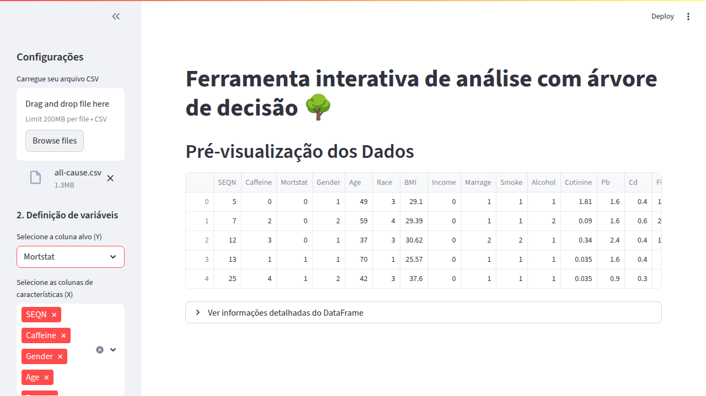
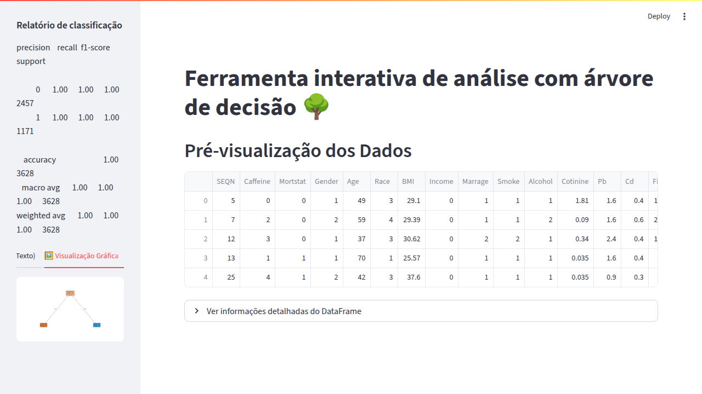

# Projeto de Mineração de Dados com Árvore de Decisão em Python

## 🎯 Para que este projeto serve?

Este projeto serve para **análise de dados médicos e pesquisa em saúde pública**, especificamente focado na **relação entre consumo de cafeína e mortalidade**. É uma ferramenta completa de ciência de dados que oferece:

### ✨ **Principais aplicações:**
- **🔬 Pesquisa Médica**: Analisa fatores de risco e proteção relacionados à mortalidade
- **📊 Educação em Data Science**: Demonstra implementação prática de árvores de decisão (similar ao C5.0/C4.5)
- **🧠 Machine Learning**: Pipeline completo de ML desde o carregamento até avaliação do modelo
- **💻 Interface Interativa**: Tanto versão linha de comando quanto interface web intuitiva

### 📋 **English Summary:**
This project serves as a **medical data analysis and public health research tool**, specifically focused on analyzing the **relationship between caffeine consumption and mortality**. It provides both command-line and interactive web interfaces for decision tree classification using scikit-learn, making it valuable for medical research, data science education, and machine learning demonstrations.

---

## 📝 Descrição Técnica

O projeto demonstra um exemplo prático de mineração de dados utilizando um algoritmo de árvore de decisão (similar ao C5.0/C4.5) em Python com a biblioteca `scikit-learn`. O objetivo é carregar dados de um arquivo CSV, treinar um modelo classificador e extrair regras de decisão interpretáveis.

## 📝 Descrição

O script Python (`app.py` ou o nome que você deu) realiza as seguintes etapas:
1.  Carrega dados de um arquivo CSV especificado (ex: `all-cause.csv`).
2.  Permite a seleção de uma coluna alvo (variável a ser prevista) e utiliza as demais como características (features).
3.  Realiza um pré-processamento básico:
    * Codifica a variável alvo textual para numérica usando `LabelEncoder`.
    * Verifica e alerta sobre dados faltantes nas características, com um exemplo simples de preenchimento para colunas numéricas.
    * Verifica e alerta sobre colunas de características não numéricas, que precisam ser tratadas (ex: via one-hot encoding).
4.  Divide os dados em conjuntos de treinamento e teste.
5.  Cria e treina um modelo de Árvore de Decisão (`DecisionTreeClassifier` do `scikit-learn`), utilizando o critério de entropia (similar ao ganho de informação do C4.5/C5.0).
6.  Avalia o desempenho do modelo no conjunto de teste usando acurácia e um relatório de classificação detalhado.
7.  Exibe as regras de decisão aprendidas pela árvore em formato textual, facilitando a interpretação do modelo.

## ✨ Funcionalidades

* Carregamento de dados de arquivos CSV.
* Flexibilidade na definição da coluna alvo.
* Pré-processamento básico e alertas para etapas adicionais necessárias.
* Treinamento de modelo de árvore de decisão configurável (profundidade máxima, critério, etc.).
* Avaliação robusta do modelo (acurácia, precisão, recall, F1-score).
* Extração e visualização de regras de decisão inteligíveis.

## 📋 Pré-requisitos

* Python 3.6 ou superior.
* As seguintes bibliotecas Python:
    * `pandas`
    * `streamlit`
    * `scikit-learn`
    * `matplotlib` (opcional, para visualização gráfica da árvore, se descomentado no código)

## 🛠️ Instalação

1.  Clone este repositório ou baixe os arquivos do projeto.
2.  Certifique-se de ter o Python 3.6+ instalado.
3.  Instale as bibliotecas necessárias usando pip:
    ```bash
    # Opção 1: Instalação via requirements.txt (recomendado)
    pip install -r requirements.txt
    
    # Opção 2: Instalação manual
    pip install pandas scikit-learn matplotlib streamlit
    ```

## 🚀 Como Usar

### 🖥️ **Interface de Linha de Comando (app.py)**

1.  **Prepare seu arquivo de dados**:
    * Certifique-se de que seu arquivo de dados (ex: `all-cause.csv`) está em formato CSV.
    * Coloque o arquivo CSV no mesmo diretório do script Python ou atualize a variável `file_path` no script com o caminho correto para o arquivo.

2.  **Configure o Script**:
    * Abra o arquivo Python (ex: `app.py`) em um editor de texto ou IDE.
    * **Muito Importante**: Encontre e ajuste a variável `target_column_name` para o nome exato da coluna em seu CSV que você deseja prever.
        ```python
        target_column_name = 'NOME_DA_SUA_COLUNA_ALVO' # <--- MUDE AQUI
        ```
    * (Opcional) Se desejar usar apenas um subconjunto específico de colunas como características (features), modifique a seção de definição de `X`.
    * (Opcional) Ajuste os parâmetros do `DecisionTreeClassifier` (`max_depth`, `min_samples_leaf`, etc.) conforme necessário para o seu conjunto de dados.

3.  **Execute o Script**:
    ```bash
    python app.py
    ```

### 🌐 **Interface Web Interativa (app_ui.py)**

Para uma experiência mais intuitiva, utilize a versão com interface gráfica:

```bash
streamlit run app_ui.py
```

**Funcionalidades da interface web:**
- 📁 Upload de arquivos CSV via drag-and-drop
- 🎯 Seleção interativa da variável alvo
- ⚙️ Configuração de parâmetros do modelo via sliders
- 📊 Visualização de resultados em tempo real
- 🌳 Visualização gráfica da árvore de decisão
- 📋 Regras de decisão em formato texto

### 📸 **Screenshots das Interfaces**

**Interface Web Inicial:**


**Interface Configurada:**


**Resultados da Análise:**


## 📊 Dataset e Caso de Uso

### 🔬 **Dados de Cafeína e Mortalidade**
O projeto utiliza o dataset `all-cause.csv` que contém dados sobre:

- **👤 Demografia**: Gênero, idade, etnia, estado civil
- **☕ Consumo de Cafeína**: Níveis de cafeína no sangue
- **🏥 Saúde**: BMI, pressão arterial, diabetes, doenças cardíacas, câncer, etc.
- **💊 Estilo de Vida**: Tabagismo, consumo de álcool, renda
- **🧪 Biomarcadores**: Cotinina, chumbo, cádmio
- **🍽️ Nutrição**: Fibra, gordura, proteína, carboidratos, colesterol
- **📈 Desfecho**: Status de mortalidade (Mortstat) - variável alvo principal

### 🎯 **Objetivo da Análise**
Identificar quais fatores (incluindo consumo de cafeína) estão mais associados com mortalidade, gerando regras de decisão interpretáveis que podem auxiliar em:

- **Pesquisa epidemiológica** sobre fatores de risco
- **Políticas de saúde pública**
- **Orientações médicas personalizadas**
- **Educação em análise de dados médicos**

---

## 📄 Arquivo de Entrada

O script é projetado para usar um arquivo CSV como entrada. O exemplo principal utiliza `all-cause.csv`.
Este conjunto de dados é baseado em:
Wang, Kun (2023). *Caffeine and mortality dataset*. figshare. Dataset. https://doi.org/10.6084/m9.figshare.22725806.v1

O script tentará:
* Ler este arquivo automaticamente.
* Identificar as 32 colunas de dados.
* Usar uma coluna como alvo (ex: `Mortstat` para status de mortalidade).
* Utilizar as outras como preditoras (características).

**Atenção**: O script inclui verificações básicas para dados faltantes e tipos de dados não numéricos nas colunas preditoras (X). A interface web aplica automaticamente transformações como one-hot encoding para variáveis categóricas.

## 📊 Saída Esperada

O script imprimirá no console:
1.  As primeiras linhas do DataFrame carregado e informações sobre as colunas.
2.  Alertas sobre pré-processamento (se dados faltantes ou não numéricos forem detectados em X).
3.  A acurácia do modelo de árvore de decisão no conjunto de teste.
4.  Um relatório de classificação detalhado (precisão, recall, F1-score por classe).
5.  As regras da árvore de decisão em formato textual.
6.  (Opcional) Se a seção de visualização gráfica da árvore com `matplotlib` for descomentada e as bibliotecas estiverem configuradas, uma janela com a imagem da árvore será exibida.

## 🔧 Customização

* **Seleção de Features**: Você pode facilmente modificar quais colunas são usadas como características (X) alterando a linha `X = df.drop(columns=[target_column_name])` ou definindo uma lista explícita de `feature_columns`.
* **Pré-processamento Avançado**: Para conjuntos de dados mais complexos, você precisará expandir a seção de pré-processamento. Isso pode incluir:
    * Tratamento mais sofisticado de dados faltantes (ex: `SimpleImputer` do scikit-learn).
    * Codificação de variáveis categóricas em `X` (ex: `OneHotEncoder` ou `pd.get_dummies`).
    * Escalonamento de features (ex: `StandardScaler` ou `MinMaxScaler`).
* **Ajuste de Hiperparâmetros**: Experimente diferentes valores para os hiperparâmetros do `DecisionTreeClassifier` (como `max_depth`, `min_samples_split`, `min_samples_leaf`) para otimizar o desempenho do modelo. Técnicas como `GridSearchCV` podem ser usadas para isso.
* **Outros Modelos**: Sinta-se à vontade para experimentar outros algoritmos de classificação do `scikit-learn` no lugar do `DecisionTreeClassifier`.

## ⚠️ Disclaimer

O tratamento de dados faltantes e a codificação de variáveis categóricas nas features (X) no script fornecido são exemplificativos. É crucial que você analise seu conjunto de dados e aplique as técnicas de pré-processamento mais adequadas para garantir a qualidade e o desempenho do modelo.